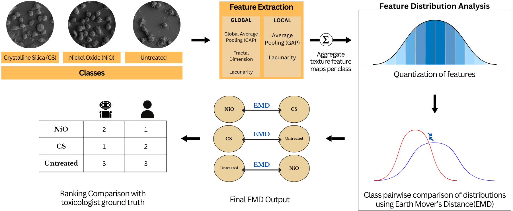

# Texture Analysis of Lung Cell Morphology After Nanoparticle Exposure:
**Texture Analysis of Lung Cell Morphology After Nanoparticle Exposure**

_Akshatha Mohan and Joshua Peeples_



Note: If this code is used, cite it: Akshatha Mohan and Joshua Peeples. This code's public release is a work-in-progress and will be cleaned up following submissions to bioRxiv and SPIE Medical Imaging 

[`Zendo`](). 
[]

[`IEEE Xplore (SPIE Medical Imaging, TBD)`]()

[`bioRxiv`]()

[`BibTeX`]()

In this repository, we provide the paper and code for the "Texture Analysis of Lung Cell Morphology After Nanoparticle Exposure."

## Installation Prerequisites

This code uses python and necessary packages in pytorch
Please use [`Pytorch's website`](https://pytorch.org/get-started/locally/) to download necessary packages.

## Demo

1) Run `demo.py` in Python IDE (e.g., Spyder) or command line.

2) For multiple kernels and quantizations, run the command below:
```
python demo.py --kernel_sizes 5 7 9 11 13 15 21 --quant_levels 2 3 4 5 6 7
``` 


## Parameters
The parameters can be set in the following script:

```Demo_Parameters.py```

## Inventory

```
https://github.com/Advanced-Vision-and-Learning-Lab/SEM_Images_Lacunarity/tree/SPIE

└── root dir
	├── demo.py   //Run this. Main demo file.
	├── Demo_Parameters.py // Parameters file for demo.
	├── Prepare_Data.py  // Load data for demo file.
	├── View_Results.py // Run this after demo to view saved results.
    ├── Datasets
		├── Dataset_Class.py // Return Index for datasets
	└── Image_Crop  //Image Preprocessing functions
		├── Remove_Outliers.py // Return images after image denoising
		├── Image_Crop.py // Return images after removing metadata on the image
	└── Utils  //utility functions
		├── Base_Lacunarity.py // Compute base lacunarity pooling layer
		├── Compute_EMD.py // Compute Earth Mover's Distance (EMD)
		├── Cosine_Similarity.py // Compute cosine similarity for aggregate function
		├── Fractal_Dimension.py // Compute fractal dimension
		├── Global_Aggregate.py // Global texture feature extraction
		├── Local_Aggregate.py // Contains fractal pooling approach
    	├── Quantization.py  // Function to quantize texture feature
```

## License

This source code is licensed under the license found in the [`LICENSE`](LICENSE) 
file in the root directory of this source tree.

This product is Copyright (c) 2023 A. Mohan and J. Peeples. All rights reserved.

## <a name="CitingTextureAnalysis"></a>Citing Texture Analysis of Lung Cell Morphology After Nanoparticle Exposure

If you use the code, please cite the following 
reference using the following entry.

**Plain Text:**

A. Mohan and J. Peeples, “Texture Analysis of Lung Cell Morphology After Nanoparticle Exposure”, SPIE Medical Imaging, in Press.

**BibTex:**
```

```
